# SSAFIT

|                                   SSAFIT Main                                  |
| :----------------------------------------------------------------------------------------: |
| 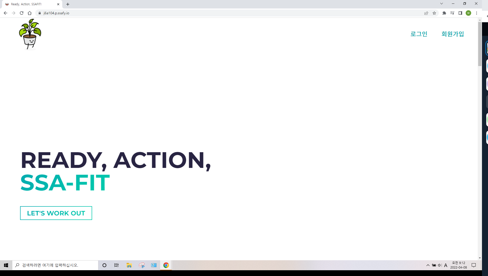 |
| :----------------------------------------------------------------------------------------: |
| 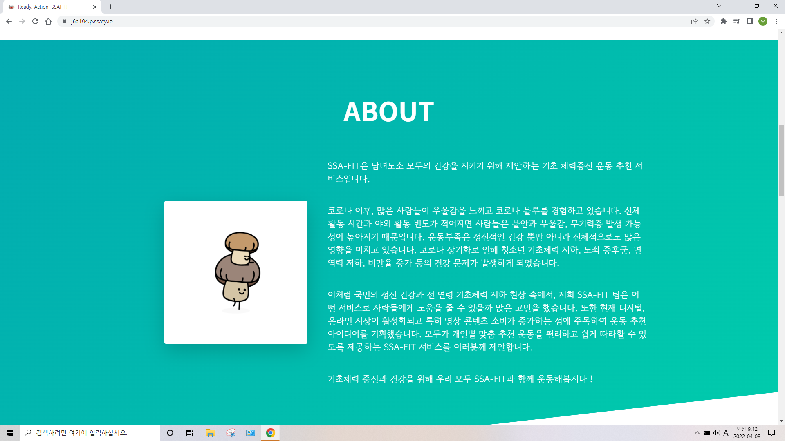 |
| :----------------------------------------------------------------------------------------: |
| 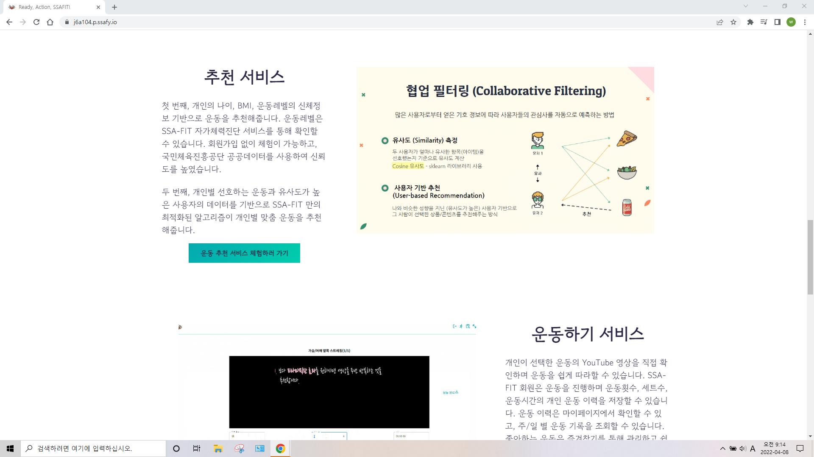 |
| :----------------------------------------------------------------------------------------: |
| 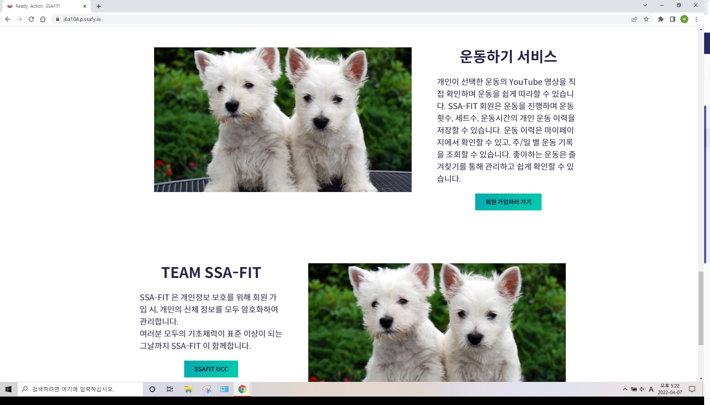 |

<br/>

## 목차
1. [**서비스 소개**](#1)
1. [**기술 스택**](#2)
1. [**주요 기능**](#3)
1. [**프로젝트 구성도**](#4)
1. [**개발 팀 소개**](#5)
1. [**개발 기간 및 일정**](#6)
1. [**실행 방법**](#7)

<div id="1"></div>

## 💁 서비스 소개
**싸핏(SSAFIT)** 은 빅데이터를 기반으로 사용자의 신체 정보(키, 몸무게, 나이, 성별, 운동레벨 등)를 입력받아 개인별 맞춤 건강 운동을 추천해주는 서비스입니다. 

싸핏은 사용자들의 신체 정보와 유사도를 파악하여 운동을 추천해줍니다.

유튜브 API를 활용하여 사용자가 선택한 운동에 맞는 영상을 보여줍니다.

사용자가 했던 운동 이력과 즐겨찾는 운동의 리스트를 언제든지 보여줍니다.

반응형 디자인을 적용하여 쾌적한 화면으로 서비스를 이용하실 수 있습니다.

<br />

<div id="2"></div>

## 🛠 기술 스택

### **Front-end**

|  |  |  |
| :----------------------------------------------------------------------------------------------------------------------------: | :--------------------------------------------------------------------------------------------------------------------------: | :-----------------------------------------------------------------------------------------------------------------------------: |
|                                                             HTML5                                                              |                                                             CSS3                                                             |                                                           TypeScript                                                            |

|  |  |  |  |
| :-------------------------------------------------------------------------------------------------------------------------------: | :-------------------------------------------------------------------------------------------------------------------: | :------------------------------------------------------------------------------------------------------------: | :------------------------------------------------------------------------------------------------------------------------------------------------------------------: |
|                                                               React                                                               |                                                         Redux                                                         |                                                   React Router                                                   |                                                                             axios                                                                              |

|  |  |  |
| :----------------------------------------------------------------------------------------------------------: | :--------------------------------------------------------------------------------------------------------------------------: | :--------------------------------------------------------------------------------: | 
|                                                           Emotion                                                            |                                        MUI                                         |                                                     MSW                                               |

### **Back-end**

|  |  |  |  |  |
| :--------------------------------------------------------------------------------------------------------------------------: | :---------------------------------------------------------------------------------------------------------------------------------------------: | :------------------------------------------------------------------------------------------------------------------------------------------------------------------: | :----------------------------------------------------------------------------------------------------------------------------: | :----------------------------------------------------------------------------------------------------: |
|                                                             Java                                                             |                                                                   Spring-Boot                                                                   |                                                                              Hibernate                                                                               |                                                             MariaDB                                                              |                                                   H2                                                   |

|  |  |  | |
| :--------------------------------------------------------------------------------------------------------------------------------------------------------------------------------------------------: | :-------------------------------------------------------------------------------------------------------------------------: | :----------------------------------------------------------------------------------------------------------------------------: |:----------------------------------------------------------------------------------------------------------------------------: |
|                                                                                               Python                                                                                                |                                                           Swagger                                                           |                                                             redis                                                              |Numpy

|  |  |  |
| :--------------------------------------------------------------------------------------------------------------------------------------------------------------------------------------------------: | :-------------------------------------------------------------------------------------------------------------------------: | :----------------------------------------------------------------------------------------------------------------------------: |
|                                                                                               Jupyter                                                                                               |                                                           pandas                                                           |                                                             sklearn                                                              |

### **DevOps**

|  |  |  |  |
| :-------------------------------------------------------------------------------------------------------------------: | :------------------------------------------------------------------------------------------------------------------------------: | :-----------------------------------------------------------------------------------------------------------------------------------------------------------: | :------------------------------------------------------------------------------------------------------------------------------: |
|                                                         NGiNX                                                         |                                                               aws                                                                |                                                                            Jenkins                                                                            |                                                              docker                                                              |

<br />

<div id="3"></div>

## 💡 주요 기능

| 기능                      | 내용                                                                                                                                |
| :------------------------ | :---------------------------------------------------------------------------------------------------------------------------------- |
| 신체 정보 기반 운동 추천                  | 키, 몸무게, 나이, 운동레벨 등 사용자의 신체 정보에 기반하여 운동을 추천해줍니다. |
| 유사도 기반 운동 추천               |     사용자들 간의 유사도를 측정하여 나와 비슷한 사용자가 한 운동들을 추천해줍니다.       |
| YouTube API 영상               |    YouTube API를 활용하여 사용자가 추천받은 운동 영상을 제공합니다.|
| 즐겨찾기 기능 |  즐겨찾기한 운동들을 빠르게 찾을 수 있습니다.                |
| 운동 이력 조회  |     나의 운동 이력을 날짜별로 확인할 수 있습니다.      |
| 반응형 웹  |     반응형 디자인으로 디바이스 상관없이 쾌적한 화면으로 즐기실 수 있습니다.      |

<br />

|                                   신체 정보 기반 운동 추천                                  |
| :----------------------------------------------------------------------------------------: |
| 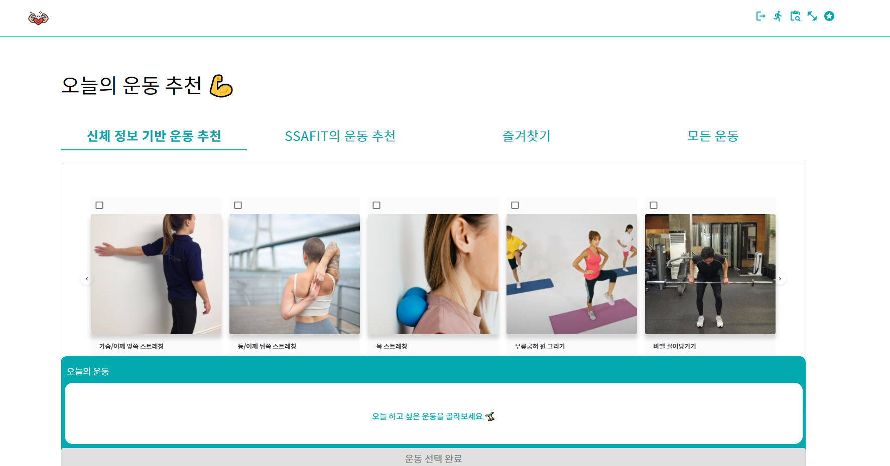 |

|                                   유사도 기반 운동 추천                                   |
| :----------------------------------------------------------------------------------------: |
| 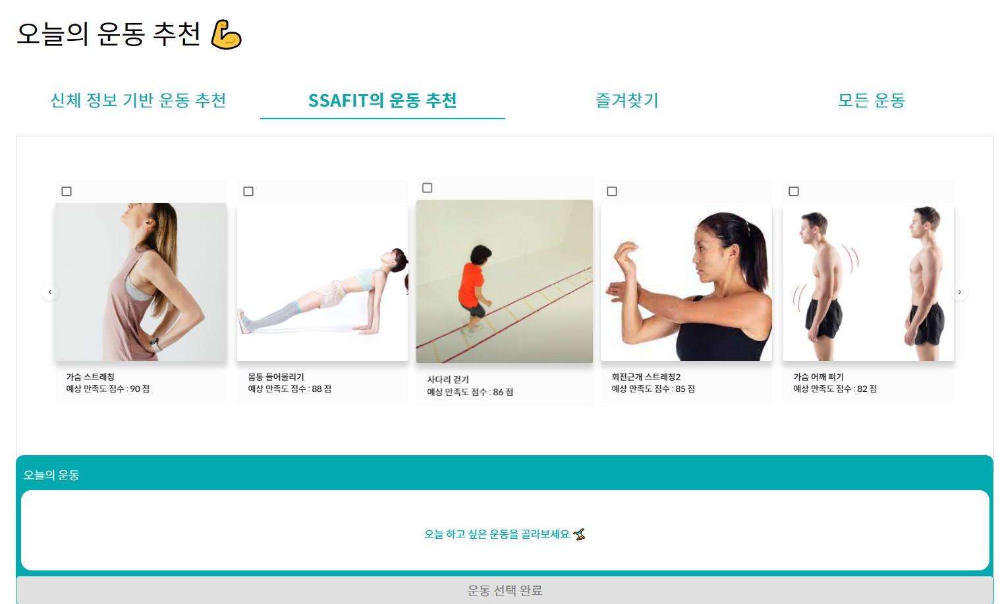 |

|                                   YouTube API 영상                                   |
| :----------------------------------------------------------------------------------------: |
| 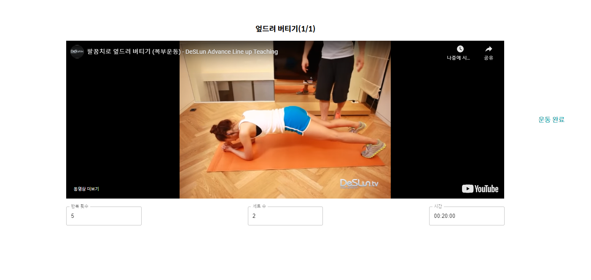 |

|                                  즐겨찾기 기능                                   |
| :----------------------------------------------------------------------------------------: |
| 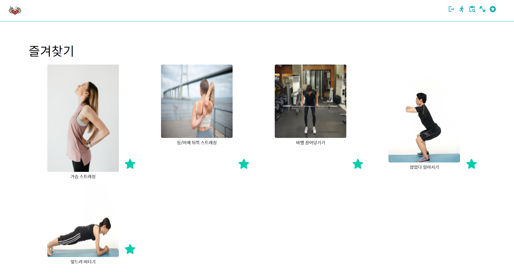 |

|                                  운동 이력 조회                                   |
| :----------------------------------------------------------------------------------------: |
| 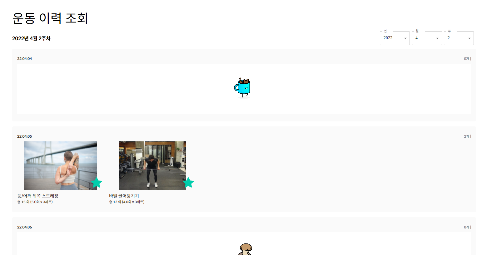 |

<br />

<div id="4"></div>

## 📂 프로젝트 구성도

|                                   아키텍처(Architecture)                                   |
| :----------------------------------------------------------------------------------------: |
| 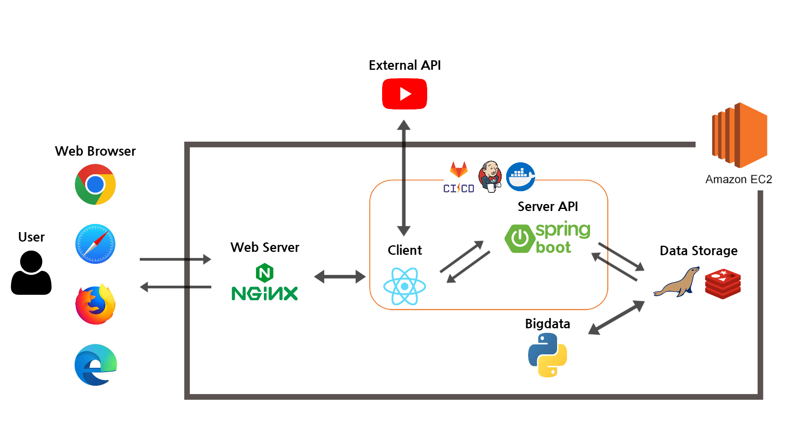 |

|                              개체-관계 모델(ERD)                               |
| :----------------------------------------------------------------------------: |
| 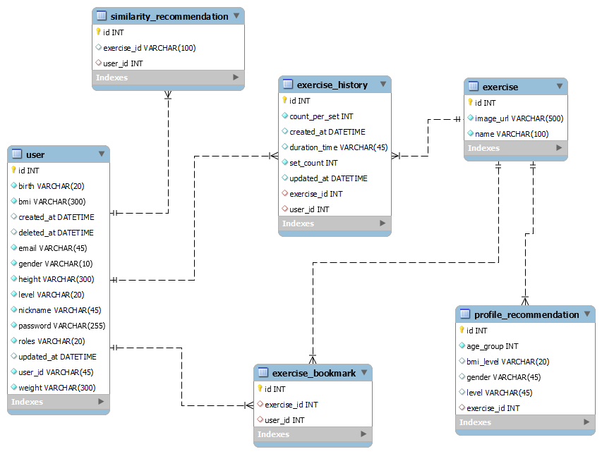 |

<div id="5"></div>

## 👪 개발 팀 소개
| <div align="center">이름</div> |   <div align="center">역할</div>     | <div align="center">개발 내용</div>                                                                                                                                                |
| :----: | :----------------: | :--------------------------------------------------------------------------------------------------------------------------------------------------------------------------------------------------------------------------------------------------------------------------------------------------------------------------------------------------------------------------------------------------------------------------------------------------------------------------------------------------------------------------------------------------------------------------------------------------------------------------------------------------------------------------------------------------------------------------------------------------------------------------------------------------------------------------------------------------------------------------------------------------------------------------------------------------------------------------------------------------------------------------------------------------------------------------------------- |
| 손영배 | Back-end<br />팀장 |- DB 설계<br /> - 추천 알고리즘 구현<br /> &nbsp;&nbsp;&nbsp;&nbsp;- 데이터 전처리, 더미 데이터 제작<br />&nbsp;&nbsp;&nbsp;&nbsp;- Cron Job 스케쥴링 적용<br /> - Spring Boot RESTful API 작성<br /> &nbsp;&nbsp;&nbsp;&nbsp;- 전체 운동 리스트 조회<br /> &nbsp;&nbsp;&nbsp;&nbsp;- 신체정보 기반 추천(비로그인/로그인) 운동 조회                                                                                                                                                                                                                                                                                                                                                                                                                                                                                                                                                                                                            |
| 조은솔 |      Back-end      | - DB 설계<br /> - 추천 알고리즘 구현<br /> - 데이터 전처리, 더미 데이터 제작<br /> - Spring Boot RESTful API 작성<br /> &nbsp;&nbsp;&nbsp;&nbsp;- 즐겨찾기, 유사도 기반 추천 운동 조회<br />&nbsp;&nbsp;&nbsp;&nbsp;- 운동 이력 저장<br /> - Back-end Leader
| 조원빈 |      Back-end      | - DB 설계<br />- CI/CD 환경 설정<br />- Spring Boot RESTful API 작성<br />&nbsp;&nbsp;&nbsp;&nbsp;- 로그인, 회원가입 도메인 개발<br />&nbsp;&nbsp;&nbsp;&nbsp;- 운동 이력 조회, 즐겨찾기<br />- GitLab 담당                                    
| 윤홍림 |     Front-end      | - 추천 알고리즘 구현<br /> - 기본 정보 수정 페이지 작성<br /> - 데이터 전처리, 더미 데이터 제작<br /> - JIRA 담당
| 김나경 |     Front-end      |- 회원가입 로그인 서비스 구현 <br />&nbsp;&nbsp;&nbsp;&nbsp;- 이메일 인증 및 입력정보 유효성 검사를 통한 불필요한 통신 최소화<br /> &nbsp;&nbsp;&nbsp;&nbsp;- 비로그인 체험 사용자의 회원가입시 신체정보 입력값 연동 <br />&nbsp;&nbsp;&nbsp;&nbsp;- Redux, Redux Saga를 통한 로그인 구현 <br />- 아이디 찾기, 비밀번호 재설정 구현 <br />- Emotion을 이용한 CSS-in-JS 방식으로 스타일링 작업 <br />- 미디어 쿼리를 이용한 반응형 구현 <br />- Mock Service Worker를 이용해 API 테스트 진행<br />- Notion 담당                                                                                                                                                                                                                     
| 이여진 |     Front-end      |- 서비스 메인 홈페이지 개발 - 추천 운동 조회 및 운동 영상, 운동 저장 기능 구현 <br />- Redux, Redux Saga를 통한 운동 기록 조회 기능 구현 <br />- 비로그인 사용자 체험 서비스 개발 <br />- 'Emotion'을 이용한 CSS-in-JS 방식으로 스타일링 구현 <br />- 'Media Query'를 이용한 반응형 웹 구현 <br />- Mock Service Worker를 이용해 목업 API 구현하여 백엔드 API 설계 이전 API 테스팅 진행  <br />- Front-end Leader                                                                                                                                                                                                                                                                                             

<br />

<div id="6"></div>

## 📅 개발 기간 및 일정

### 22.02.28 ~ 22.04.08 (6주)

<br />

<div id="7"></div>

## 💻 실행 방법

### Client 실행

1. **원격 저장소 복제**
```bash
$ git clone https://lab.ssafy.com/s06-bigdata-rec-sub2/S06P22A104.git
```
2. **프로젝트 폴더로 이동**
```bash
$ cd frontend
```
3. **필요한 node_modules 설치**
```bash
$ yarn install
```
4. **클라이언트 서버 실행**
```bash
$ yarn start
```
<br />

### Server 실행

1. **원격 저장소 복제**
```bash
$ git clone https://lab.ssafy.com/s06-bigdata-rec-sub2/S06P22A104.git
```
2. **프로젝트 폴더로 이동**
```bash
$ cd backend/spring/src/main/resources/
```
3. **application.yml 파일 생성**

	처음 실행한 뒤 jpa.hibernate.ddl-auto: create 옵션을 jpa.hibernate.ddl-auto: none 으로 바꾼다.

```yml
server:
  port: [서버 포트]

spring:

  redis:
    host: [서버 도메인]
    port: [redis 포트]

  mail:
    host: smtp.gmail.com
    port: [이메일 포트]
    username: [구글 아이디]
    password: [구글 비밀번호]
    properties:
      mail.smtp.auth: true
      mail.smtp.starttls.enable: true

  datasource:
    url: jdbc:mariadb://[도메인]:[port]/ssafit?serverTimezone=Asia/Seoul&characterEncoding=UTF-8
    driver-class-name: org.mariadb.jdbc.Driver
    username: [DB 사용자명]
    password: [DB PASSWORD]
  jpa:
    database-platform: org.hibernate.dialect.MySQL5InnoDBDialect
    open-in-view: false
    generate-ddl: true
    show-sql: true
    hibernate:
      ddl-auto: create
    properties:
      hibernate:
        jdbc:
          batch_size: 100
          order_inserts: true
          order_updates: true
        

jwt:
  time: 259200000 # 72 hour
  secret: [토큰 비밀키]
```
4. **프로젝트 빌드**
```bash
$ ./gradlew build
```
5. **빌드 폴더 이동 후 jar 파일 실행**
```bash
$ cd backend
$ cd spring/build/libs
$ java -jar [파일명].jar
```
<br />
