# 시연 시나리오

 

| No.  |                           시나리오                           |                          상세 설명                           |                           스크린샷                           |
| :--: | :----------------------------------------------------------: | :----------------------------------------------------------: | :----------------------------------------------------------: |
|  1   |                       메인 페이지 소개                       |               싸핏 서비스의 메인페이지입니다.                |  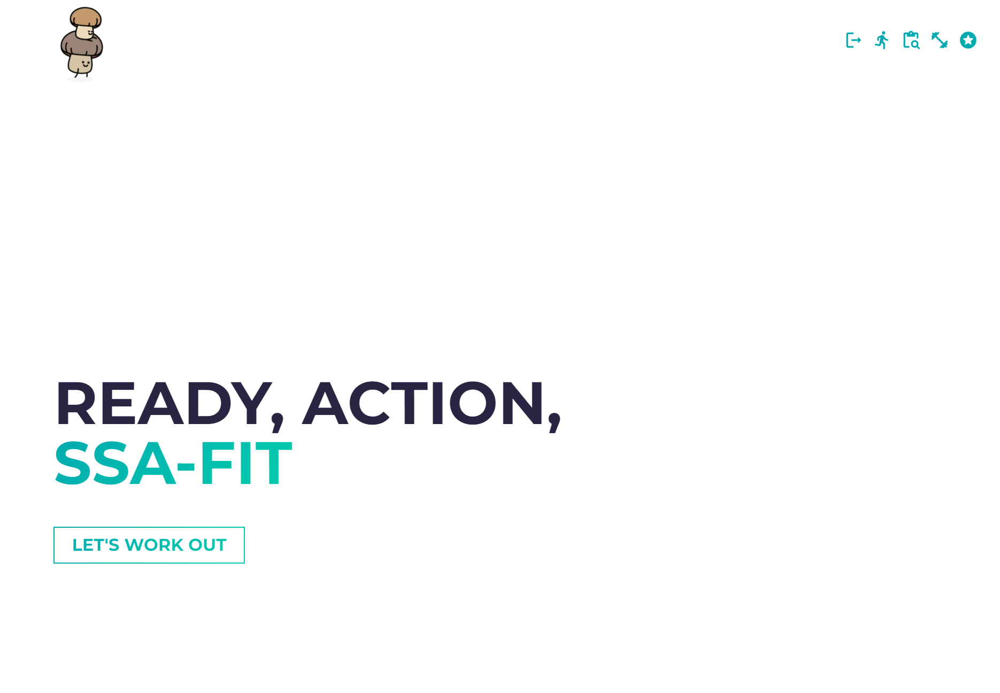  |
|  2   |                스크롤 내리면서 화면 보여주기                 | 메인페이지 스크롤을 내리면, 서비스 소개와 추천알고리즘, UCC 등의 내용을 확인할 수 있습니다. |  |
|  3   |                  비회원으로 서비스 이용하기                  | 회원가입을 하지 않아도 싸핏을 체험해 볼 수 있습니다. 메인페이지의 "LET'S WORK OUT" 버튼을 눌러 신체정보 입력 페이지로 넘어갑니다. |  |
|  4   |                      신체정보 입력하기                       |  자신의 생년월일, 키, 몸무게, 성별, 운동레벨을 입력합니다.   |  |
|  5   |                   운동 추천 화면으로 이동                    | 입력한 신체정보에 기반한 추천 운동리스트를 확인할 수 있습니다. |  |
|  6   | 싸핏 운동 추천, 즐겨찾기 화면 보여주기 (회원가입해야 이용 가능) | SSAFIT 운동 추천과 즐겨찾기 운동은 회원가입을 해야 이용 가능합니다. | 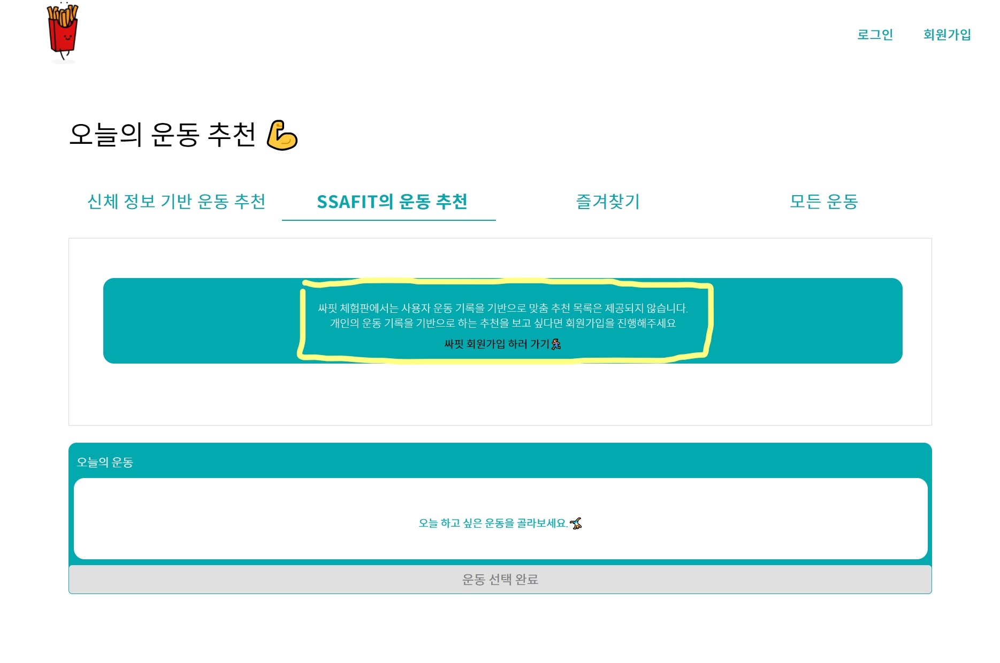 |
|  7   |                    회원가입 화면으로 이동                    |           회원가입은 총 4단계로 이루어져 있습니다.           |  |
|  8   |                          약관 동의                           |                       1단계. 약관 동의                       | 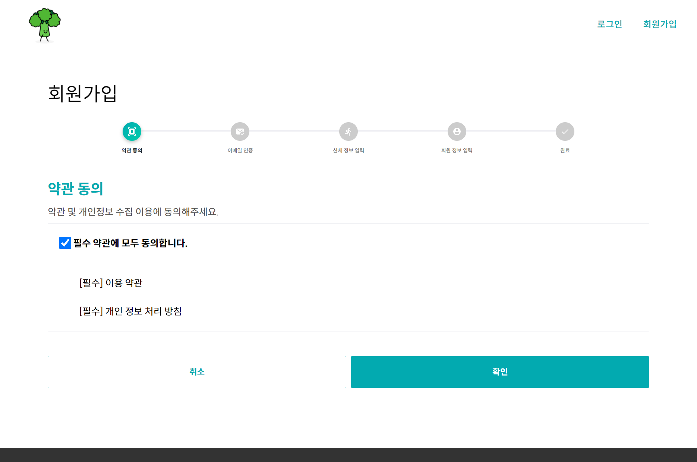 |
|  9   |                         이메일 인증                          |                      2단계. 이메일 인증                      | 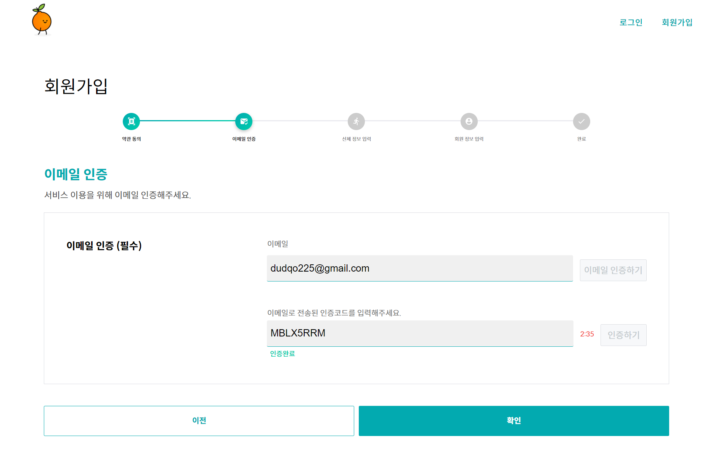 |
|  10  |                        신체 정보 입력                        |                    3단계. 신체 정보 입력                     | 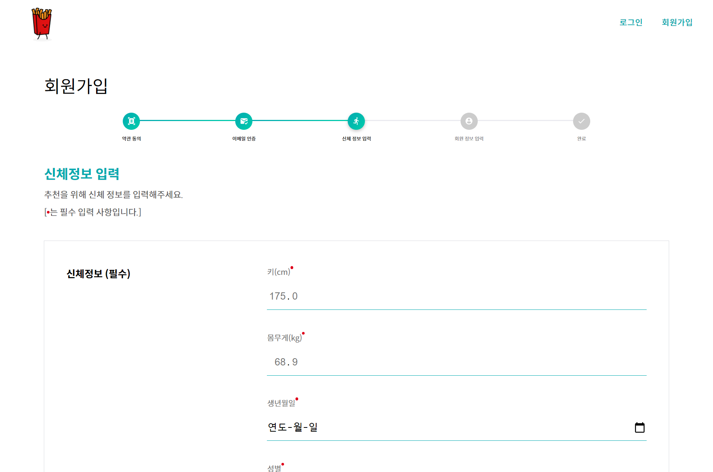 |
|  11  |                        회원 정보 입력                        |                    4단계. 회원 정보 입력                     | 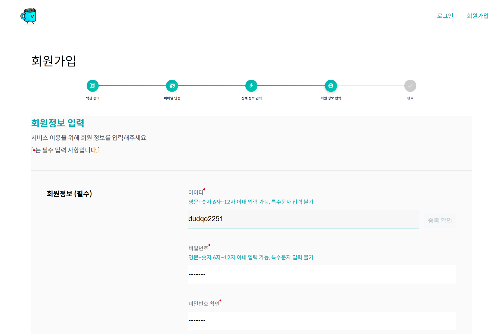 |
|  12  |                        회원가입 완료                         |      4단계의 회원가입을 진행하면 회원가입이 완료됩니다.      | 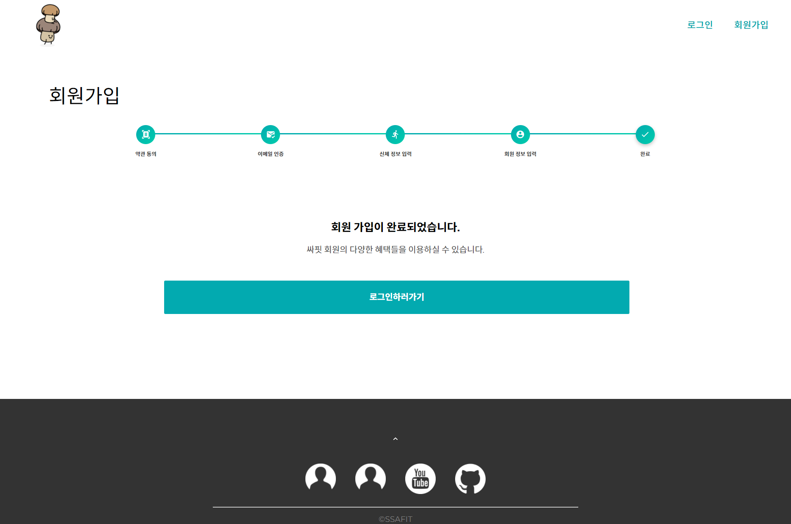 |
|  13  |                     로그인 (아이디 저장)                     |   로그인 페이지에서는 자신의 아이디를 저장할 수 있습니다.    | 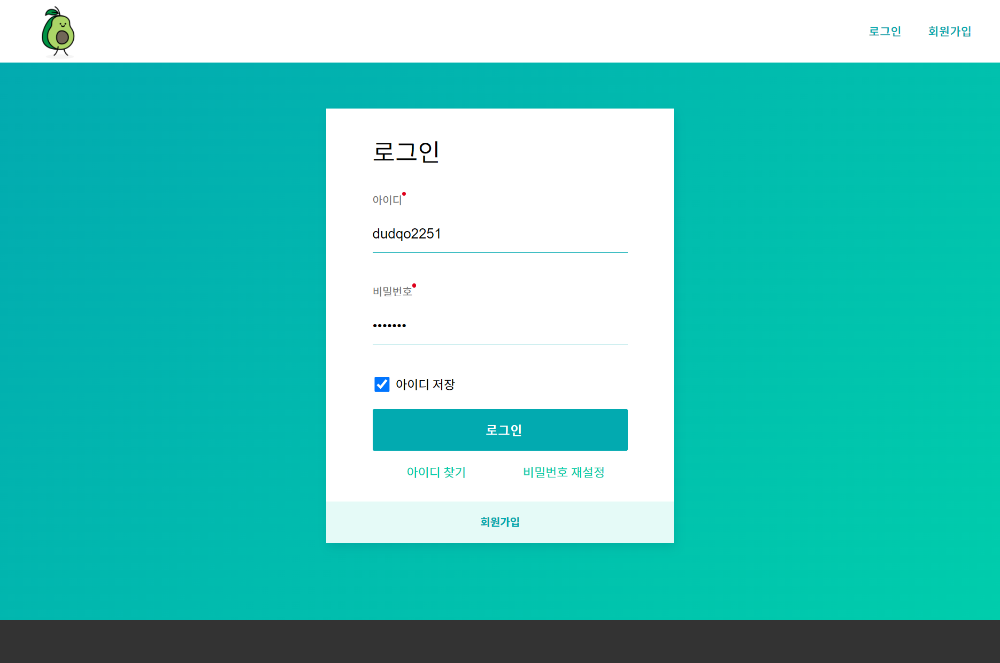 |
|  14  |                아이디 찾기 & 비밀번호 재설정                 | 혹시 아이디를 잊어버렸거나 비밀번호가 기억나지 않으면, 아이디 찾기와 비밀번호 재설정 기능을 이용할 수 있습니다. |  |
|  15  |                     운동 추천 화면 이동                      | 운동 추천 화면으로 이동하여 자신이 추천 받은 운동, 전체 운동 등을 확인할 수 있습니다. | 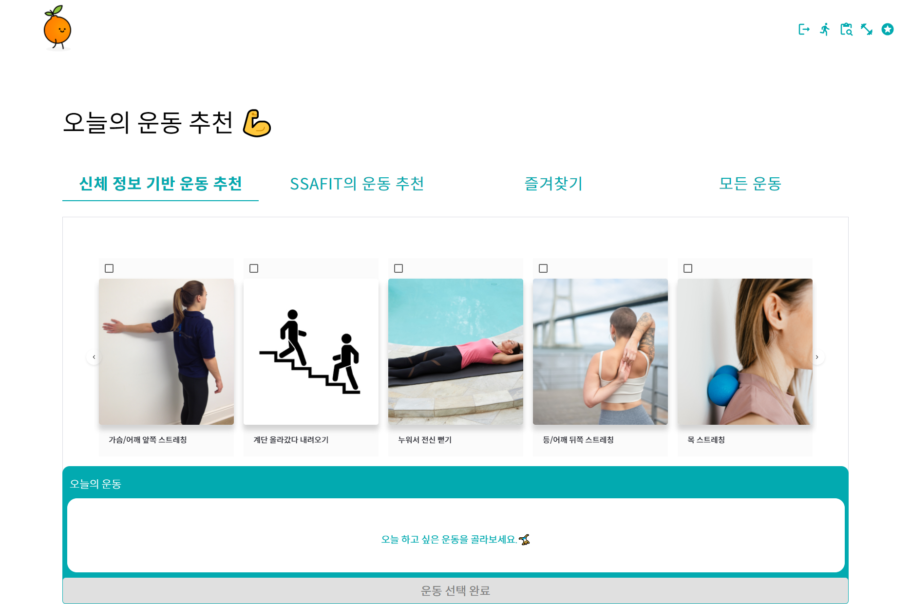 |
|  16  |          운동 추천, 즐겨찾기 운동 뜨는 것 보여주기           | 기존의 운동이력이나 즐겨찾기 이력이 있으면 관련된 운동 리스트를 확인할 수 있습니다. SSAFIT 운동 추천은 사용자간 유사도를 기반으로 한 추천 알고리즘이 적용된 기능으로, SSA-FIT의 핵심 기능입니다. |  |
|  17  |                         운동 고르기                          |       자신이 수행하기 원하는 운동을 고를 수 있습니다.        | 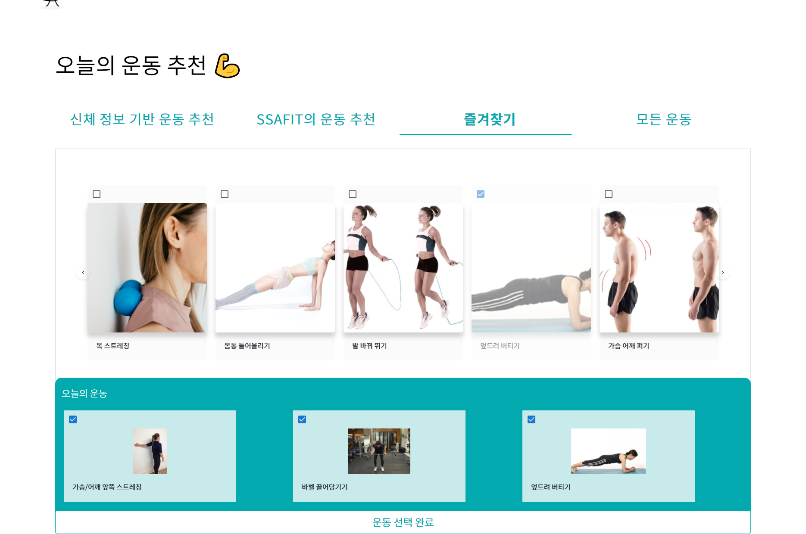 |
|  18  |                  각 운동 유튜브 영상 고르기                  | 운동 선택 이후에는 각 운동별 유튜브 영상을 선택하게 됩니다.  | 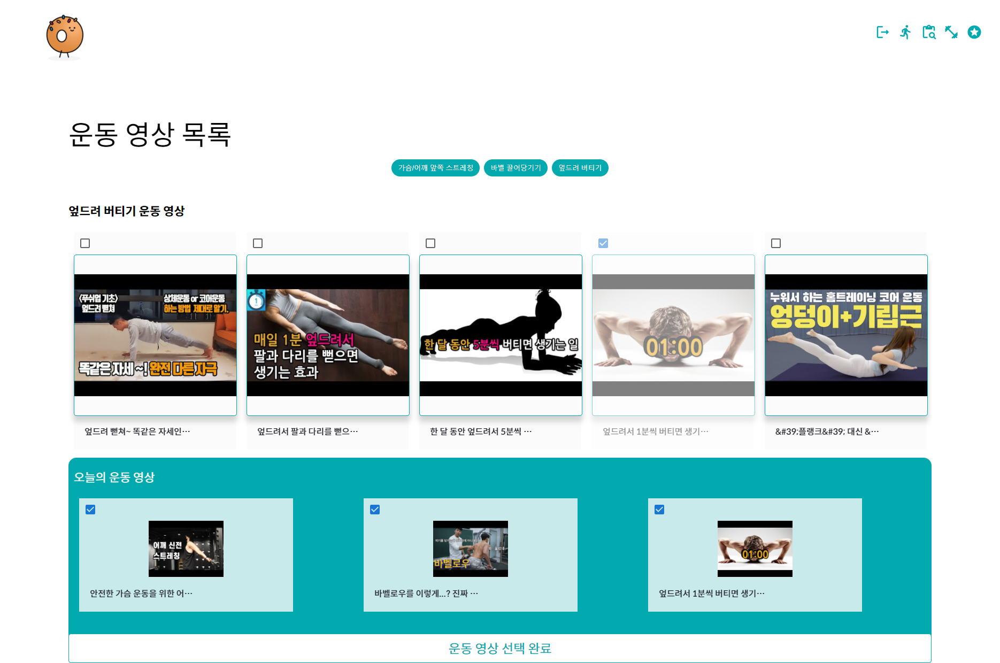 |
|  19  |             운동 콘텐츠 소비하면서 운동 기록하기             | 유튜브 영상을 확인하면서 운동 횟수, 세트수, 운동 시간 등을 기록할 수 있습니다. |  |
|  20  |                        운동 이력 조회                        | 월,주,일로 구분되는 운동 이력을 조회할 수 있는 페이지입니다. | 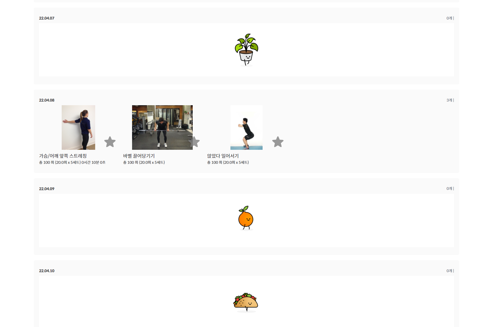 |
|  21  |                      즐겨찾기 등록하기                       | 각 운동 이미지의 "☆" 모양을 클릭하면 즐겨찾기로 등록할 수 있습니다. |  |
|  22  |                   즐겨찾기 페이지 보여주기                   | 즐겨찾기 페이지에서는 자신이 선호하는 운동 목록을 확인할 수 있습니다. | 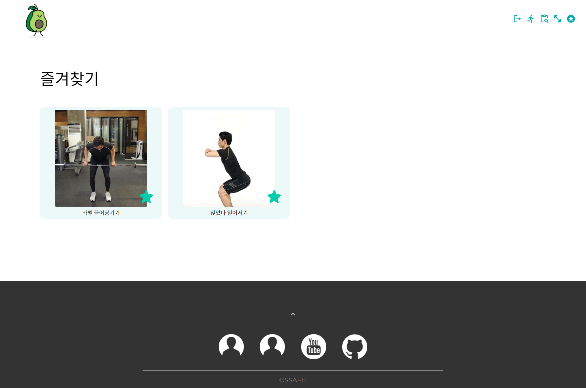 |
|  23  |                  정보 수정 페이지 보여주기                   | 운동을 함에 따라, 키/몸무게/운동능력 등이 바뀔 수 있기 때문에, 정보 수정 페이지에서 자신의 신체정보를 변경할 수 있습니다. | 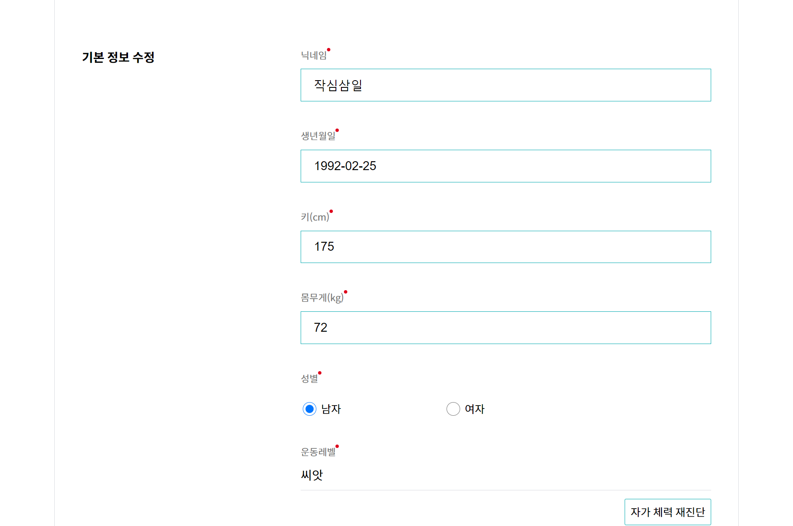 |
|  24  |                     반응형 화면 보여주기                     | 반응형으로 구현되어 있기 때문에 데스크탑, 태블릿, 모바일 등 어떤 환경에서도 각 환경에 알맞고 편리한 SSA-FIT 서비스를 이용할 수 있습니다. | 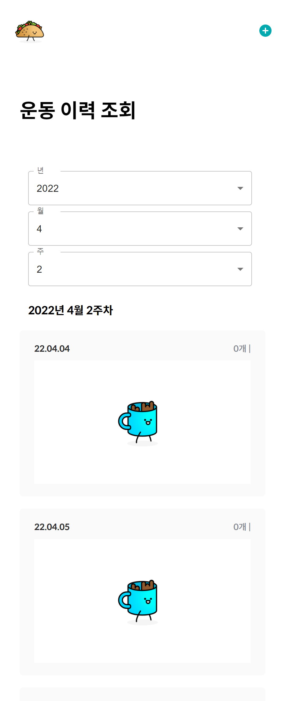 |